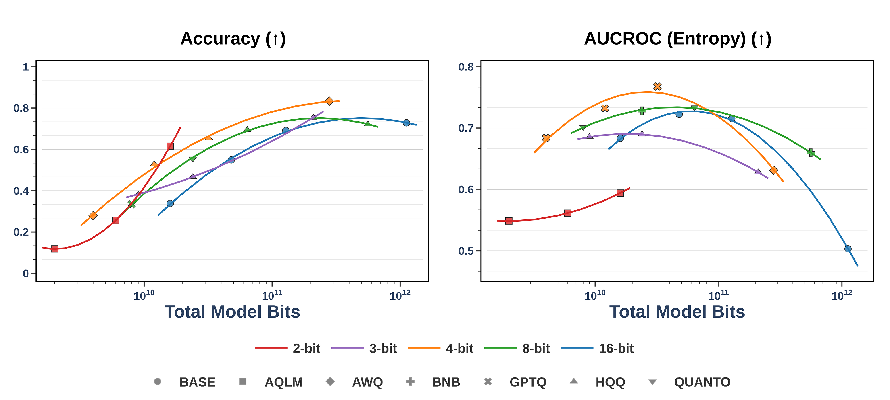

# Reliability Evaluation of Extreme Quantization for Large Language Models

[](https://openreview.net/forum?id=UUBijehMQO) [](https://openreview.net/forum?id=UUBijehMQO) [](https://drive.google.com/file/d/1mwWKyoR03iH0K4S17mO-G17IGpjMORgv/view?usp=sharing) [](https://github.com/PrunaAI) [](LICENSE) [](https://github.com/PrunaAI/quantization-reliability)

*Sirine Ayadi, Sándor Daróczi, Stephan Günnemann, Bertrand Charpentier*

*Published at [TMLR 2026](https://openreview.net/forum?id=UUBijehMQO) & [ICML 2026 SCALE Workshop](https://scale-icml-2026.github.io/)*

We study reliability bit-level scaling laws for quantized LLMs to find the optimal precision that maximizes the reliability under a fixed bit budget. Our reliability evaluation covers uncertainty, calibration, and robustness to 15 natural input perturbations. We find that 4-bit precision offers the best reliability-efficiency tradeoff across tasks, model families, and quantization methods.

## Robustness under text perturbations

Real users type with tpyos, slang, emoji :), and miXeD CasE. We implement **15 natural input perturbations** on the character- and word-level to evaluate model robustness.

<p align="center">
  
  <br>
  <em>Overview of our character-level and word-level input perturbations. Illustrated is an example where perturbations with intensity level 1 are applied to a standard question prompt.</em>
</p>

<p align="center">
  
  <br>
  <em>Radar plots of the accuracy (Top) and AUCROC (Entropy) (bottom) across all 15 character-level and word-level perturbations for two intensities. We evaluate the base LLaMA-3-8B model and five 4-bit quantization methods. Quantized models can provide more reliable uncertainty estimates under natural perturbations compared to their base counterparts, while maintaining close performance.</em>
</p>

---

## Scaling laws for reliability

We characterize trends in reliability as the total number of bits scales. We model a metric as a function of total bits using a log quadratic scaling law.

<p align="center">
  
  <br>
  <em>Bit-level scaling trends of the accuracy and AUCROC (Entropy) on TriviaQA. We use four base models (blue): LLaMA-3.2-1B, LLaMA-3.2-3B, LLaMA-3-8B, and LLaMA-3-70B, and their corresponding quantized variants using six quantization methods and different bitwidths.</em>
</p>

---

## Code

Clone the repo and set up the environment:

```bash
git clone https://github.com/PrunaAI/quantization-reliability.git
cd quantization-reliability
bash setup_env.sh
conda activate quant-rel
```

Run a reliability evaluation:

```bash
python experiments/run.py \
  exp_id=my_run \
  model_name=llama32_1b \
  hardware=single_gpu \
  dataset=triviaqa
```

This loads the model, runs generation, scores the outputs (accuracy, calibration,
uncertainty), and saves the results to an Excel file under `results/`.

- `model_name`: any model in `src/model_loading/registry/models.py`, base or quantized
- `dataset`: a config in `experiments/configs/dataset/`
- `hardware`: a config in `experiments/configs/hardware/`. Use `cpu` for a quick smoke test, but quantized models need a GPU (`single_gpu` / `multi_gpu_*`)

Every parameter is Hydra-configurable, see `experiments/configs/config.yaml` for the full list (batch size, temperature, number of examples, W&B logging, etc.).

---

## Citation

```bibtex
@article{
ayadi2026reliability,
title={Reliability Scaling Laws for Quantized Large Language Models},
author={Sirine Ayadi and S{\'a}ndor Dar{\'o}czi and Stephan G{\"u}nnemann and Bertrand Charpentier},
journal={Transactions on Machine Learning Research},
issn={2835-8856},
year={2026},
url={https://openreview.net/forum?id=UUBijehMQO},
note={}
}
```

---

## License

MIT — see [LICENSE](LICENSE) for details.
